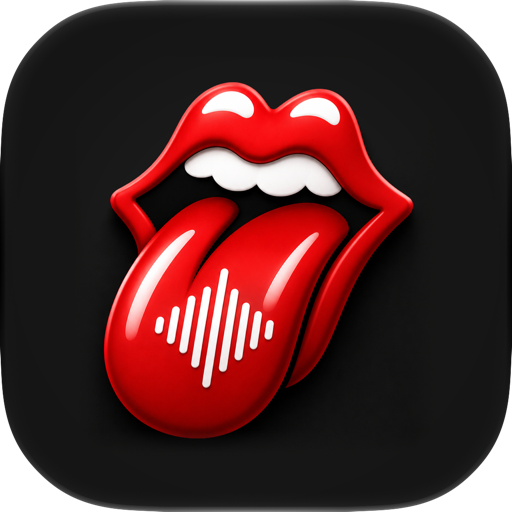

<p align="center">
  
</p>
<h1 align="center">Voice</h1>
<h4 align="center">On-device dictation and spoken planning for macOS</h4>

## How it works

Voice lives in the menu bar. Hold a key, speak, release: the text lands in
the app you were using. Audio, recognition, cleanup, insertion, and speech
synthesis never leave your Mac.

- Hold **Right Option**, speak, release. Voice transcribes and types the
  result into the focused app. Left Option is ignored, so editor shortcuts
  keep working.
- Hold **Shift**, then **Right Option**, to also polish the transcript with
  Apple's on-device Foundation Model.
- Insertion stays bound to the exact element that had focus when you pressed
  the key, and Voice never presses Return for you.

Planning connects dictation to an agent. Each agent has a stated boundary:

- **Apple On-Device** uses the system Foundation Model with no tools, no
  network, no project-file reads, and no persistent conversation state.
- **Codex** talks to the local Codex app-server in read-only planning mode. It
  receives finalized text and a read-only working directory, and may send
  project context to its model. Audio never crosses this boundary.
- **ACP agent** drives an Agent Client Protocol v1 executable you pick, over
  stdio, with permission requests denied and no MCP servers supplied. If the
  agent needs login, Voice runs its terminal auth command and retries once.

Only finalized text reaches an agent. While Voice speaks a response, Escape or
**Stop Speaking** silences it without disconnecting.
[`docs/privacy.md`](docs/privacy.md) lists every boundary in detail.

## Requirements

- To run: an Apple Silicon Mac on macOS 26 or later.
- To build: an Xcode 27 beta. Voice uses macOS 27 SDK APIs, so the released
  Xcode 26.x toolchain cannot compile it.

## Build

```fish
brew install xcodegen just
xcodebuild -downloadComponent MetalToolchain
just build
just test
```

macOS ties permission grants to the app's code identity, so for anything
beyond compile checks, sign with a stable identity. Put your Team ID in a
local config once:

```fish
cp Configs/Project.local.xcconfig.example Configs/Project.local.xcconfig
open -e Configs/Project.local.xcconfig
just release-signed
open .build/DerivedData-Release/Build/Products/Release/Voice.app
```

Without that file, builds fall back to ad-hoc signing, whose identity changes
every rebuild; Microphone, Accessibility, and Input Monitoring grants will not
stick. Every recipe runs through `scripts/xcbuild.sh`, which recovers from an
Xcode 27 explicit-modules bug by clearing DerivedData and rebuilding once when
the "Clang dependency scanning failure" appears.

## First run

Grant Microphone, Accessibility, and Input Monitoring from Voice's Settings.
If the Event tap row does not read **Ready** after you change Privacy &
Security, quit and reopen Voice. Then focus a text field, hold Right Option
until the overlay says **Listening**, speak, and release.

Insertion tries the Accessibility API first. Terminals that reject it (cmux,
Ghostty, Zed) get process-targeted key events instead, one grapheme at a time
so their event loops do not drop characters. This fallback is on by default
and costs nothing for apps that accept direct insertion.

Pick a project in Settings to build a speech vocabulary from its file names.
Voice reads the names, never the contents. History is off by default; when
enabled it is AES-GCM encrypted with a device-bound Keychain key, and export
is always explicit.

## Dictation models

Apple Speech is the default recognizer. Settings › Dictation adds five local
MLX models to experiment with:

| Model | Download | Notes |
|---|---|---|
| Qwen3 0.6B 8-bit | ~1.0 GB | smaller starting point |
| Qwen3 1.7B 8-bit | ~2.5 GB | larger option |
| Granite 4.0 Speech 1B 5-bit | ~2.1 GiB | project keywords in its prompt |
| Cohere Transcribe 2B 8-bit | ~2.3 GiB | English decoding |
| Parakeet TDT 0.6B v3 | ~2.3 GiB | 25 European languages |

Selecting one downloads a pinned snapshot from Hugging Face into
`~/Library/Application Support/io.blacktop.Voice/MLXModels`, then keeps that
model warm. Microphone samples stay in memory and are never written to disk.
Transcription runs after you release the key; Settings reports inference time,
real-time factor, and peak memory for the last turn, plus the raw transcript
next to the cleaned text it inserted. Switch back to Apple Speech before using
**Remove downloaded MLX models**.

No model here is claimed to be the fastest or most accurate. Published
benchmark numbers come from other data, hardware, and decoders. To measure
your own voice, record clips into `Bench/corpus/` (gitignored) as pairs like
`refactor-note.wav` and `refactor-note.txt` with the exact words spoken, then:

```fish
just bench
```

Each downloaded model transcribes every clip; the report shows word error rate
and mean real-time factor per model. Settings also has a comparison mode that
runs one recording through every downloaded model in sequence.

## Spoken responses

The system synthesizer is the default voice. Settings › Spoken responses adds
local Qwen3-TTS voices in two tiers, fast 0.6B (~1.1 GB) and higher-quality
1.7B (~2.4 GB), with three modes:

- **Preset voice**: built-in speakers Ryan and Aiden, with an optional style
  such as "calm and unhurried".
- **Describe a voice**: build a new voice from prose, accents included. Always
  uses the 1.7B VoiceDesign checkpoint.
- **Clone from audio**: zero-shot cloning from a clean 3–10 second clip plus
  its exact transcript. An optional style can steer the clone's delivery.

Generation streams, so playback starts before the response finishes
synthesizing. Reference clips are conditioned in memory and never leave the
Mac.

## voice-say

The same voices as a `say`-style command, for scripts and agents:

```fish
just install    # builds and installs to ~/.local/bin, no sudo
voice-say "Build finished."
voice-say --tier large --style "calm and unhurried" "Deploy is green."
voice-say --describe "a warm narrator with a South African accent" "Ready."
echo "piped text" | voice-say --voice Aiden
```

With no flags it speaks in whatever voice the app is configured to use, so it
reuses the checkpoint the app already downloaded. Each flag overrides only
what it names. `--help` documents every option, `--list-voices` shows presets
and download sizes, and `--generate-completion-script fish` emits completions.

One `voice-say` speaks at a time. A second invocation skips and exits 0, so a
burst of announcements from several agents collapses to one instead of queueing
minutes of stale speech. Pass `--wait` to queue.

Install with `just install` rather than copying the binary: MLX loads its
Metal shaders from a bundle beside the executable, so a bare copy or symlink
cannot find them. A copy also ships inside the app at
`Voice.app/Contents/MacOS/voice-say`.

## macOS 27 beta status

On current macOS 27 betas (verified on 26A5388g), `AnalyzerInput(buffer:)`
crashes inside Speech.framework for every buffer. Reported to Apple. Voice
feeds SpeechAnalyzer through `AnalyzerInputConverter` on macOS 27 and keeps
the original conversion path on macOS 26.

## More

- [`docs/architecture.md`](docs/architecture.md): recognition paths, agent
  transports, macOS 27 adoption.
- [`docs/privacy.md`](docs/privacy.md): every data boundary and retention rule.
- [`docs/third-party.md`](docs/third-party.md): package and model pins and
  their licenses.

## License

[MIT](LICENSE). Model weights are not bundled; they download from Hugging Face
pinned by revision, under their own terms. Most checkpoints are Apache-2.0;
Parakeet TDT 0.6B v3 is CC-BY-4.0, which carries an attribution requirement.
