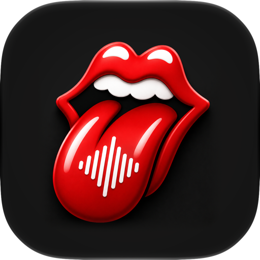

<p align="center">
  
</p>
<h1 align="center">Voice</h1>
<h4 align="center">On-device dictation and spoken planning for macOS</h4>

## How it works

Voice lives in the menu bar. Hold a key, speak, and release it to type into
the app you're using. Audio stays on your Mac, and dictation, transcript
cleanup, text insertion, and speech synthesis all run locally.

- Hold **Right Option**, speak, release. Voice transcribes and types the
  result into the focused app. Left Option is ignored, so editor shortcuts
  keep working.
- Hold **Shift**, then **Right Option**, to also polish the transcript with
  Apple's on-device Foundation Model.
- Insertion stays bound to the exact element that had focus when you pressed
  the key, and Voice never presses Return for you.

In planning mode, Voice sends the finished transcript to the agent you choose:

- **Apple On-Device** uses the system Foundation Model with no tools, no
  network, no project-file reads, and no persistent conversation state.
- **Codex** talks to the local Codex app-server in read-only planning mode. It
  receives finalized text and a read-only working directory, and may send
  project context to its model. Audio never crosses this boundary.
- **ACP agent** drives an Agent Client Protocol v1 executable you pick, over
  stdio, with permission requests denied and no MCP servers supplied. If the
  agent needs login, Voice runs its terminal auth command and retries once.

Press Escape or **Stop Speaking** to interrupt a spoken response without
disconnecting the agent. See [Privacy boundaries](docs/privacy.md) for what
each backend can read, send, and retain.

## Requirements

- To run: an Apple Silicon Mac on macOS 26 or later.
- To build: Xcode 27 with the macOS 27 SDK. Xcode 26.x can't compile the
  newer Speech APIs used here.

## Build and install

Install the build tools and Metal compiler:

```fish
brew install xcodegen just
xcodebuild -downloadComponent MetalToolchain
```

Set your signing Team ID in the local config. A stable signing identity lets
macOS retain Voice's permission grants across rebuilds:

```fish
cp -n Configs/Project.local.xcconfig.example Configs/Project.local.xcconfig
open -e Configs/Project.local.xcconfig
```

The app also needs a provisioning profile that authorizes its Keychain access
group and **Enhanced Security**. The Voice target already has
[Keychain Sharing](https://developer.apple.com/documentation/xcode/configuring-keychain-sharing)
configured in Xcode; you don't need to find a separate checkbox for it on the
developer website. Enable Enhanced Security on the explicit `io.blacktop.Voice`
App ID in your developer account. For local builds, create or regenerate a
[Mac App Development profile](https://developer.apple.com/help/account/provisioning-profiles/create-a-development-provisioning-profile)
for that App ID, your existing signing certificate, and this Mac, then download
it in Xcode. An older wildcard profile may lack Enhanced Security. Distribution
builds need a matching Developer ID profile.

Then test and install:

```fish
just test
just install
```

`just install` builds the signed Release app, installs it in `/Applications`,
relaunches it, and installs `voice-say` and `voice-notify` under `~/.local/bin`.
To install one component, use `just install-app`, `just install-cli`
(voice-say), or `just install-notify`. The CLI recipes and `just install`
accept a different bin directory as an argument.
If an older copy takes precedence on PATH, invoke the new tools explicitly as
`~/.local/bin/voice-say` or `~/.local/bin/voice-notify`.

For development, `just build` makes a Debug build and `just release-signed`
makes a signed Release build without installing it. `just build`, `just test`,
and `just release` use ad-hoc signing when no team or valid signing identity
is available. Ad-hoc builds are useful for compile checks, but their changing
identity means Microphone, Accessibility, and Input Monitoring grants won't
stick. They can't
use the device-bound Keychain for encrypted history or ntfy configuration.

The build recipes use `scripts/xcbuild.sh` to recover from an Xcode 27
explicit-modules bug. If the module scanner fails, the script clears that
build's DerivedData and retries once.

`just verify-security` checks the signed Release app for arm64e, Hardened
Runtime, Enhanced Security v2, and the hard-mode Memory Integrity Enforcement
entitlements: hardened heap, checked allocations, read-only dyld state, and
platform restrictions. It also checks that the embedded provisioning profile
has not expired and authorizes the signing certificate, explicit application
ID, private Keychain group, and Enhanced Security entitlements.
`just install-app` runs the same audit before copying the app.

## First run

Grant Microphone, Accessibility, and Input Monitoring from Voice's Settings.
If the Event tap row does not read **Ready** after you change Privacy &
Security, quit and reopen Voice. Then focus a text field, hold Right Option
until the overlay says **Listening**, speak, and release.

Voice tries Accessibility insertion first. When an app such as cmux, Ghostty,
or Zed doesn't support it, Voice sends key events to that process one grapheme
at a time. This fallback is enabled by default and only runs when direct
insertion is unavailable.

Pick a project in Settings to build a speech vocabulary from its file names.
Voice doesn't open the files. Local history is off by default. If you enable
it, Voice encrypts it with AES-GCM and a device-bound Keychain key. Exporting
history requires an explicit action.

## Dictation models

Apple Speech is the default recognizer. You can also choose one of five local
MLX models in Settings → Dictation:

| Model | Download | Notes |
|---|---|---|
| Qwen3 0.6B 8-bit | ~1.0 GB | smaller starting point |
| Qwen3 1.7B 8-bit | ~2.5 GB | larger option |
| Granite 4.0 Speech 1B 5-bit | ~2.1 GiB | project keywords in its prompt |
| Cohere Transcribe 2B 8-bit | ~2.3 GiB | English decoding |
| Parakeet TDT 0.6B v3 | ~2.3 GiB | 25 European languages |

Selecting a model downloads its pinned Hugging Face snapshot into
`~/Library/Application Support/io.blacktop.Voice/MLXModels` and keeps it loaded.
Microphone samples stay in memory. Transcription starts when you release the
key. Settings shows the last turn's inference time, real-time factor, peak
memory, raw transcript, and cleaned text. Switch back to Apple Speech before
using **Remove downloaded MLX models**.

Published benchmarks use different recordings, hardware, and decoders. To
compare these models on your own voice, put clips in the gitignored
`Bench/corpus/` directory. Each `.wav` needs a matching `.txt` with the exact
words spoken, such as `refactor-note.wav` and `refactor-note.txt`. Then run:

```fish
just bench
```

Each downloaded model transcribes every clip; the report shows word error rate
and mean real-time factor per model. Settings also has a comparison mode that
runs one recording through every downloaded model in sequence.

## Spoken responses

Voice uses the system synthesizer by default. Settings → Spoken responses
also has local Qwen3-TTS voices in small 0.6B (~1.1 GB) and large 1.7B
(~2.4 GB) tiers:

- **Preset voice**: built-in speakers Ryan and Aiden, with an optional style
  such as "calm and unhurried".
- **Describe a voice**: build a new voice from prose, accents included. Always
  uses the 1.7B VoiceDesign checkpoint.
- **Clone from audio**: zero-shot cloning from a clean 3–10 second clip plus
  its exact transcript. An optional style can steer the clone's delivery.

The experimental Breeze TTS 2 engine uses one 3.5B, 4-bit checkpoint
(~3.0 GB). It supports the same three modes, turning preset names into voice
descriptions. Breeze returns a complete utterance before playback starts, and
its weights are licensed for research and non-commercial use only. See the
[model licenses](docs/third-party.md) before using it.

Qwen3 can start playback while it generates the rest of a response. Voice
processes clone reference clips in memory; they never leave the Mac.

## voice-say

Use Voice's local voices from scripts, read Markdown documents aloud, or speak
short agent updates:

```fish
voice-say "Build finished."
voice-say --file notes.md --timings
```

The [voice-say guide](docs/voice-say.md) covers voice selection, document
narration, playback controls, and tuning.

## Agent notifications

`voice-notify` sends native Mac notifications, with tmux and Zed project click
targets and optional phone push through ntfy:

```fish
voice-notify --title "Build · Voice" --message "All checks passed." \
    --group voice-build --no-pane
```

See the [voice-notify guide](docs/voice-notify.md) for persistent alerts,
project targeting limits, notification groups, `voice-say --notify`, and phone setup.

## macOS 27 beta status

`AnalyzerInput(buffer:)` traps in Speech.framework on the tested macOS 27
builds 26A5388g and 26B5091g. The issue has been reported to Apple. Voice uses
the asynchronous `AnalyzerInputConverter` on macOS 27 and keeps the original
conversion path on macOS 26.

## More

- [`docs/architecture.md`](docs/architecture.md): recognition paths, agent
  transports, macOS 27 adoption.
- [`docs/privacy.md`](docs/privacy.md): every data boundary and retention rule.
- [`docs/third-party.md`](docs/third-party.md): package and model pins and
  their licenses.

## License

[MIT](LICENSE). Model weights download separately from pinned Hugging Face
revisions under their own terms. Most checkpoints are Apache-2.0. Parakeet TDT
0.6B v3 is CC-BY-4.0 and requires attribution; Breeze TTS 2 weights permit
research and non-commercial use only. See [Third-party notices](docs/third-party.md).
